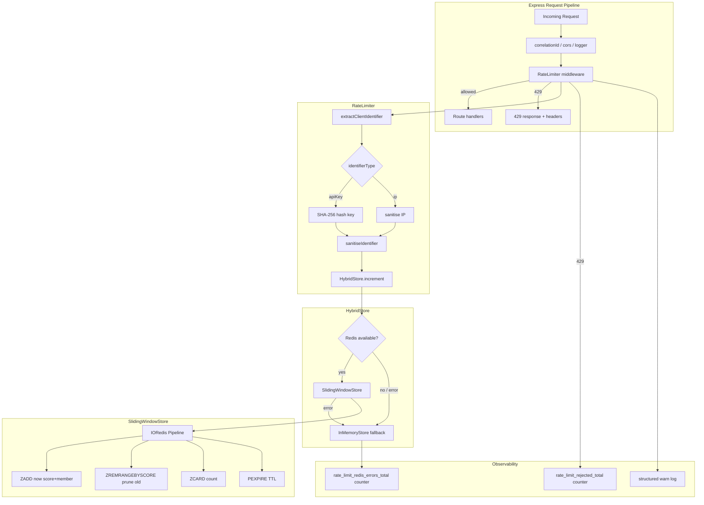

# Design Document: Redis Sliding-Window Rate Limiter

## Overview

The current `src/middleware/rateLimiter.ts` maintains per-process in-memory counters. In a horizontally-scaled deployment each replica enforces its own limit independently, effectively multiplying the allowed request rate by the replica count. This design replaces the counter store with a Redis-backed sliding-window implementation while keeping the existing middleware contract intact.

The approach is:

1. Extract a `RateLimitStore` interface so the middleware is decoupled from the storage backend.
2. Implement `SlidingWindowStore` in `src/redis/rateLimitStore.ts` using IORedis sorted-set pipelines.
3. Wrap both implementations in a `HybridStore` that falls back to the in-memory store on Redis errors.
4. Update `createRateLimiter` to accept an optional store, defaulting to the hybrid store.
5. Update `GET /api/rate-limits` to query the live store rather than a local snapshot.
6. Add SHA-256 hashing of API keys and identifier sanitisation before any Redis write.
7. Emit structured logs and Prometheus counters for 429 responses and Redis errors.
8. Register `SlidingWindowStore.close()` as a shutdown hook.

No existing public API contracts (response shapes, header names, route paths) change.

---

## Architecture



### Key design decisions

- **Sorted-set pipeline** — ZADD + ZREMRANGEBYSCORE + ZCARD + PEXPIRE in a single `multi()` pipeline gives an accurate sliding window with one Redis round-trip per request. Each member is `{timestamp}-{random}` to avoid collisions within the same millisecond.
- **Constructor-injected RedisClient** — `SlidingWindowStore` receives a `RedisClient` via its constructor, matching the pattern already used by `RedisDedupCache`. This keeps the class testable with a fake client.
- **HybridStore wraps both backends** — mirrors the `HybridDedupCache` pattern already in `src/redis/dedup.ts`. The middleware never calls Redis directly; it always goes through the store interface.
- **SHA-256 API key hashing** — raw key material must not appear in Redis keys. The hash is computed in the middleware layer before the identifier reaches the store, consistent with how `src/lib/apiKey.ts` already hashes keys for storage.
- **Identifier sanitisation in the store** — the store is the last line of defence; it sanitises and truncates the identifier regardless of what the caller passes.
- **`REDIS_ENABLED=false` bypass** — when Redis is disabled the factory skips construction of `SlidingWindowStore` entirely and returns a plain `InMemoryStore`, avoiding any connection attempt.

---

## Components and Interfaces

### `RateLimitStore` interface (`src/types/rateLimit.ts` addition)

```typescript
export interface RateLimitStore {
  increment(key: string, windowMs: number, limit: number): Promise<{ count: number; resetAt: number }>;
  getCount(key: string, windowMs: number): Promise<{ count: number; resetAt: number }>;
  close(): Promise<void>;
}
```

### `SlidingWindowStore` (`src/redis/rateLimitStore.ts`)

Implements `RateLimitStore` using IORedis sorted sets.

```typescript
export class SlidingWindowStore implements RateLimitStore {
  constructor(client: RedisClient) { ... }
  async increment(key: string, windowMs: number, limit: number): Promise<{ count: number; resetAt: number }> { ... }
  async getCount(key: string, windowMs: number): Promise<{ count: number; resetAt: number }> { ... }
  async close(): Promise<void> { ... }
}
```

Key construction: `fluxora:rl:{sanitised-identifier}:{routeKey}`

Pipeline per `increment` call:
1. `ZADD key NX {now} "{now}-{random}"`
2. `ZREMRANGEBYSCORE key -inf {now - windowMs}`
3. `ZCARD key`
4. `PEXPIRE key {windowMs}`

`getCount` uses `ZCOUNT key {now - windowMs} +inf` (read-only, no pipeline needed).

### `InMemoryStore` (`src/redis/rateLimitStore.ts`)

Wraps the existing counter logic from `rateLimiter.ts` behind the `RateLimitStore` interface. Extracted verbatim so the middleware can delegate to it without duplication.

### `HybridStore` (`src/redis/rateLimitStore.ts`)

```typescript
export class HybridStore implements RateLimitStore {
  constructor(
    private readonly primary: RateLimitStore,   // SlidingWindowStore
    private readonly fallback: RateLimitStore,  // InMemoryStore
    private readonly onError: (err: unknown, op: string) => void,
  ) {}
}
```

On any error from `primary`, logs via `onError`, increments `rate_limit_redis_errors_total`, and delegates to `fallback`. Tracks which backend was used so the middleware can set `X-RateLimit-Store`.

### Updated `createRateLimiter` (`src/middleware/rateLimiter.ts`)

Signature change:

```typescript
export function createRateLimiter(
  env?: Record<string, string | undefined>,
  store?: RateLimitStore,   // optional injection for tests
): RateLimiter
```

When `store` is not provided, the factory builds a `HybridStore` (or plain `InMemoryStore` when `REDIS_ENABLED=false`).

The `RateLimiter` interface gains a `store` property so `GET /api/rate-limits` can call `store.getCount` directly:

```typescript
export interface RateLimiter {
  (req: Request, res: Response, next: NextFunction): void;
  getStatus(identifier: string, identifierType: 'ip' | 'apiKey', path?: string, method?: string): Promise<RateLimitStatus>;
  extractClientIdentifier(req: Request): { identifier: string; identifierType: 'ip' | 'apiKey' };
  store: RateLimitStore;
  close(): Promise<void>;
}
```

Note: `getStatus` becomes `async` because it now queries the store.

### Updated `GET /api/rate-limits` (`src/routes/rateLimits.ts`)

The handler calls `limiter.store.getCount(key, windowMs)` to obtain a live Redis count instead of reading from the local in-memory snapshot. When the store is in fallback mode the response body includes `"degraded": true`.

### Prometheus metrics (`src/metrics.ts` additions)

```typescript
export const rateLimitRejectedTotal = new Counter({
  name: 'rate_limit_rejected_total',
  help: 'Total requests rejected by the rate limiter',
  labelNames: ['identifier_type', 'route'],
  registers: [registry],
});

export const rateLimitRedisErrorsTotal = new Counter({
  name: 'rate_limit_redis_errors_total',
  help: 'Total Redis errors that triggered rate-limit fallback',
  labelNames: ['operation'],
  registers: [registry],
});
```

---

## Data Models

### Redis key format

```
fluxora:rl:{identifierType}:{sanitisedIdentifier}:{routeKey}
```

- `identifierType`: `ip` or `apikey`
- `sanitisedIdentifier`: SHA-256 hex digest (for API keys) or sanitised IP string, truncated to 256 chars, with characters outside `[A-Za-z0-9._-]` replaced by `_`
- `routeKey`: URL path with `/` replaced by `_` and leading `_` stripped, e.g. `api_streams` for `/api/streams`; `global` when no route-specific budget applies

Example: `fluxora:rl:apikey:a3f2...c9d1:api_streams`

### Sorted-set member format

```
{timestampMs}-{6-char random hex}
```

e.g. `1718000000123-a4f9c2`

The random suffix prevents member collisions when two requests arrive within the same millisecond.

### `RateLimitStatus` (updated)

```typescript
export interface RateLimitStatus {
  identifier: string;       // masked
  identifierType: 'ip' | 'apiKey';
  limit: number;
  remaining: number;
  resetsAt: string;         // ISO-8601
  window: string;
  route?: string;
  method?: string;
  store?: 'redis' | 'memory';   // NEW
  degraded?: boolean;           // NEW — true when using fallback
}
```

### Environment variables

| Variable | Default | Description |
|---|---|---|
| `REDIS_ENABLED` | `true` | Set to `false` to skip Redis entirely |
| `REDIS_URL` | — | IORedis connection URL |
| `RATE_LIMIT_ENABLED` | `true` | Master on/off switch |
| `RATE_LIMIT_IP_WINDOW_MS` | `60000` | Window for IP-based limits |
| `RATE_LIMIT_IP_MAX` | `100` | Max requests per IP per window |
| `RATE_LIMIT_APIKEY_WINDOW_MS` | `60000` | Window for API-key limits |
| `RATE_LIMIT_APIKEY_MAX` | `500` | Max requests per API key per window |
| `RATE_LIMIT_ADMIN_MAX` | `2000` | Max requests for admin keys |

---

## Correctness Properties

*A property is a characteristic or behavior that should hold true across all valid executions of a system — essentially, a formal statement about what the system should do. Properties serve as the bridge between human-readable specifications and machine-verifiable correctness guarantees.*


### Property 1: Store contract — increment and getCount return valid shape

*For any* valid key, windowMs, and limit, calling `increment` or `getCount` on any `RateLimitStore` implementation must return an object with a non-negative integer `count` and a `resetAt` value that is a Unix timestamp in milliseconds greater than the current time.

**Validates: Requirements 1.1, 1.2, 1.4**

### Property 2: Round-trip count

*For any* identifier key and window duration, if `increment` is called N times within the window, then `getCount` called immediately after must return a count of exactly N.

**Validates: Requirements 11.1, 11.2, 2.5**

### Property 3: Redis key format

*For any* identifier type (`ip` or `apikey`) and route key, the Redis key written by `SlidingWindowStore` must start with the prefix `fluxora:rl:`, contain the identifier type, and contain the route key segment.

**Validates: Requirements 2.4, 6.1**

### Property 4: getCount is read-only

*For any* key and window, calling `getCount` twice in succession must return the same count both times (no side effects on stored state).

**Validates: Requirements 1.5**

### Property 5: Fallback on Redis error

*For any* key, window, and limit, if the primary Redis store throws an error on `increment`, the `HybridStore` must still return a valid `{ count, resetAt }` result (delegating to the in-memory fallback) and must not propagate the error to the caller.

**Validates: Requirements 3.1, 3.5**

### Property 6: Rate-limit headers present on every non-exempt response

*For any* request to a non-exempt path, the response must contain the `X-RateLimit-Limit`, `X-RateLimit-Remaining`, and `X-RateLimit-Reset` headers regardless of whether the request is allowed or rejected.

**Validates: Requirements 4.1, 4.5**

### Property 7: X-RateLimit-Remaining equals max(0, limit − count)

*For any* request where the current count is C and the effective limit is L, the `X-RateLimit-Remaining` header value must equal `Math.max(0, L - C)`.

**Validates: Requirements 4.2**

### Property 8: X-RateLimit-Reset is a valid future Unix timestamp

*For any* non-exempt request, the `X-RateLimit-Reset` header must be a positive integer representing a Unix timestamp in seconds that is greater than or equal to the current time in seconds.

**Validates: Requirements 4.3**

### Property 9: 429 response includes Retry-After header

*For any* request where the count has reached or exceeded the effective limit, the response status must be 429 and the `Retry-After` header must be present with a non-negative integer value.

**Validates: Requirements 4.4**

### Property 10: Shared Redis connection produces combined count

*For any* two `SlidingWindowStore` instances sharing the same Redis connection, if instance A increments key K by M and instance B increments key K by N, then `getCount` on either instance must return M + N.

**Validates: Requirements 5.1, 5.2, 5.3**

### Property 11: Route isolation

*For any* client identifier and two distinct routes R1 and R2 with separate budgets, exhausting the limit for R1 must not reduce the remaining capacity for R2.

**Validates: Requirements 6.2**

### Property 12: Route-specific and write-method limits applied correctly

*For any* route with a configured `baseLimit` or `writeLimit` in `ROUTE_BUDGETS`, the effective limit used by the middleware must match the configured value for the corresponding HTTP method (read vs. write).

**Validates: Requirements 6.3, 6.4**

### Property 13: Identifier sanitisation

*For any* identifier string containing characters outside `[A-Za-z0-9._-]` or longer than 256 characters, the segment of the Redis key derived from that identifier must contain only `[A-Za-z0-9._-]` characters and must be at most 256 characters long.

**Validates: Requirements 8.1, 8.2**

### Property 14: API key hashing — raw key never in Redis key

*For any* API key string, the raw key value must not appear as a substring of any Redis key written by `SlidingWindowStore`; only the SHA-256 hex digest may appear.

**Validates: Requirements 8.3**

### Property 15: rate_limit_rejected_total incremented on every 429

*For any* request that results in a 429 response, the Prometheus counter `rate_limit_rejected_total` must be incremented by exactly 1 with the correct `identifier_type` and `route` labels.

**Validates: Requirements 9.3**

### Property 16: rate_limit_redis_errors_total incremented on every Redis error

*For any* Redis operation that throws an error and triggers fallback, the Prometheus counter `rate_limit_redis_errors_total` must be incremented by exactly 1 with the correct `operation` label.

**Validates: Requirements 9.4**

### Property 17: Calls after close() are rejected

*For any* `SlidingWindowStore` instance on which `close()` has been called, any subsequent call to `increment` or `getCount` must throw an error rather than silently succeeding or hanging.

**Validates: Requirements 10.3**

---

## Error Handling

### Redis connection failure at startup

If `createRedisClient` throws during `createRateLimiter` initialisation, the factory catches the error, logs a `warn`-level message, and falls back to a plain `InMemoryStore`. The application starts normally.

### Redis error during request handling

`HybridStore.increment` wraps the primary store call in a try/catch. On error it:
1. Calls `onError(err, operation)` which logs at `warn` level and increments `rate_limit_redis_errors_total{operation}`.
2. Delegates to `fallback.increment`.
3. Sets an internal `usingFallback` flag so the middleware can set `X-RateLimit-Store: memory`.

The error is never re-thrown; `next(err)` is never called for Redis errors.

### Identifier sanitisation failure

Sanitisation is a pure string transformation and cannot throw. If the identifier is empty after sanitisation, the store uses the literal string `unknown` as the key segment.

### Close called before Redis is ready

If `close()` is called before the Redis client has connected, `RedisClient.close()` is called anyway (IORedis handles this gracefully by aborting the pending connection).

### Post-close calls

`SlidingWindowStore` maintains a `closed: boolean` flag. If `increment` or `getCount` is called after `close()`, it throws `new Error('SlidingWindowStore is closed')` synchronously.

---

## Testing Strategy

### Dual testing approach

Both unit tests and property-based tests are required. Unit tests cover specific examples, integration points, and error conditions. Property-based tests verify universal invariants across randomly generated inputs.

### Property-based testing library

Use **[fast-check](https://github.com/dubzzz/fast-check)** (already compatible with Vitest, the project's test runner). Each property test runs a minimum of **100 iterations**.

Each property test must include a comment in the format:
```
// Feature: redis-sliding-window-rate-limiter, Property N: <property text>
```

### Property test mapping

| Property | Test file | fast-check arbitraries |
|---|---|---|
| P1 Store contract | `src/redis/rateLimitStore.test.ts` | `fc.string()`, `fc.integer({ min: 1000 })`, `fc.integer({ min: 1 })` |
| P2 Round-trip count | `src/redis/rateLimitStore.test.ts` | `fc.string()`, `fc.integer({ min: 1, max: 20 })` |
| P3 Key format | `src/redis/rateLimitStore.test.ts` | `fc.string()`, `fc.constantFrom('ip', 'apikey')` |
| P4 getCount read-only | `src/redis/rateLimitStore.test.ts` | `fc.string()`, `fc.integer({ min: 1000 })` |
| P5 Fallback on error | `src/redis/rateLimitStore.test.ts` | `fc.string()`, `fc.integer({ min: 1000 })` |
| P6 Headers present | `src/middleware/rateLimiter.test.ts` | `fc.string()`, `fc.webUrl()` |
| P7 Remaining = max(0, L-C) | `src/middleware/rateLimiter.test.ts` | `fc.integer({ min: 0 })`, `fc.integer({ min: 1 })` |
| P8 Reset is future timestamp | `src/middleware/rateLimiter.test.ts` | `fc.string()` |
| P9 429 has Retry-After | `src/middleware/rateLimiter.test.ts` | `fc.integer({ min: 1 })` |
| P10 Shared connection count | `src/redis/rateLimitStore.test.ts` | `fc.integer({ min: 1, max: 10 })` |
| P11 Route isolation | `src/middleware/rateLimiter.test.ts` | `fc.string()`, route pairs |
| P12 Route limits | `src/middleware/rateLimiter.test.ts` | `fc.constantFrom(...ROUTE_BUDGETS)` |
| P13 Identifier sanitisation | `src/redis/rateLimitStore.test.ts` | `fc.string()` (full unicode) |
| P14 API key hashing | `src/redis/rateLimitStore.test.ts` | `fc.string()` |
| P15 rejected_total counter | `src/middleware/rateLimiter.test.ts` | `fc.integer({ min: 1 })` |
| P16 redis_errors_total counter | `src/redis/rateLimitStore.test.ts` | `fc.string()` |
| P17 Post-close rejection | `src/redis/rateLimitStore.test.ts` | `fc.constantFrom('increment', 'getCount')` |

### Unit test coverage

- `SlidingWindowStore` with a real IORedis client against a local Redis instance (integration test, tagged `@integration`).
- `HybridStore` with a mock primary that throws and a real `InMemoryStore` fallback.
- `createRateLimiter` with `REDIS_ENABLED=false` — asserts no Redis client is created.
- `GET /api/rate-limits` with a mock store — asserts `degraded: true` when fallback is active.
- Shutdown hook registration — asserts `store.close()` is called when `gracefulShutdown` runs.
- Header values on allowed and rejected requests using `supertest`.

### Test doubles

A `FakeRedisClient` implementing `RedisClient` backed by an in-process sorted-set simulation will be provided in `src/redis/__test__/fakeRedisClient.ts`. This allows property tests to run without a real Redis instance.
